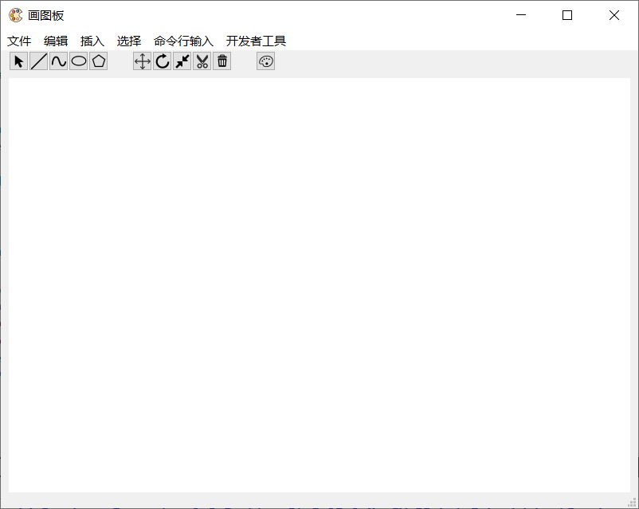
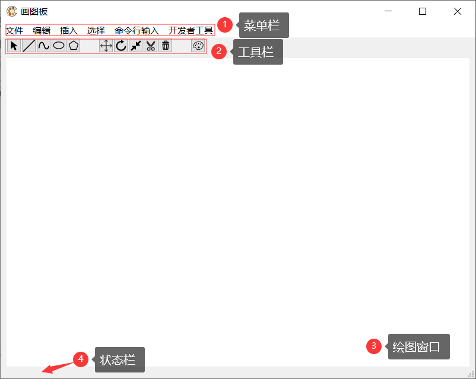
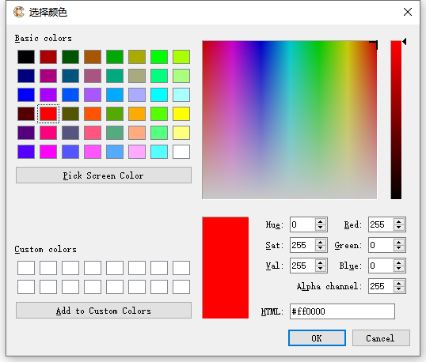
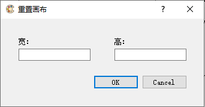

##系统使用说明书
###前言
此说明书为画图板程序的系统使用说明书。该程序作为课程《计算机图形学》的课程设计。主要实现了几种基础的图元绘制和图元变换功能。
###程序界面
  
  
程序界面主要由四部分组成，分别是菜单栏、工具栏、绘图窗口和状态栏。接下来将会详细说明程序的每个绘图功能如何使用。
###操作方法
**绘制直线**  
鼠标单击或点击菜单栏插入->直线后，看到状态栏显示“就绪-画直线”提示信息后，即可在绘图窗口按住鼠标左键，拖动绘制直线，松开结束。  
**绘制椭圆**  
鼠标单击或点击菜单栏插入->椭圆后，看到状态栏显示“就绪-画椭圆”提示信息后，即可在绘图窗口按住鼠标左键，拖动绘制椭圆，松开结束。  
**绘制多边形**  
鼠标单击或点击菜单栏插入->多边形后，看到状态栏显示“就绪-画多边形”提示信息后，即可在绘图窗口单击鼠标左键选取多边形顶点，右键单击作为最后一个顶点结束。  
**绘制曲线**  
鼠标单击或点击菜单栏插入->曲线（有两种曲线算法）后，看到状态栏显示“就绪-画曲线”提示信息后，即可在绘图窗口单击鼠标左键选取控制点，右键单击作为最后一个控制点结束。  
**选取图元**  
鼠标单击或点击菜单栏选择->选择后，看到状态栏显示“就绪-选择图元”提示信息后，即可在绘图窗口单击图元，选取成功后可以看到状态栏有响应提示信息，例如“已选择图元 id=x 类型=y”。  
**平移图元**  
鼠标单击或点击菜单栏选择->平移后，看到状态栏显示“就绪-平移变换”提示信息后，即可在绘图窗口拖动平移图元。注意，在进行图元变换前要先选取需要变换的图元，后续图元变换也要先选取图元。  
**旋转图元**  
鼠标单击或点击菜单栏选择->旋转后，看到状态栏显示“就绪-旋转变换，请先选择旋转中心”提示信息后，在绘图窗口单击鼠标左键选择旋转中心。在选择旋转中心后，状态栏会有相应提示信息。而后按住鼠标**右键**拖动来旋转图元，松开结束。  
**缩放图元**  
鼠标单击或点击菜单栏选择->缩放后，看到状态栏显示“就绪-缩放变换，请先选择缩放中心”提示信息后，在绘图窗口单击鼠标左键选择缩放中心。在选择缩放中心后，状态栏会有相应提示信息。而后滑动鼠标滚轮来对图元进行放大和缩小，单击右键结束。  
**裁剪线段**  
鼠标单击或点击菜单栏选择->裁剪线段后，看到状态栏显示“就绪，拖动以裁剪”提示信息后，按住鼠标左键，拖动选择裁剪矩形区域，松开鼠标左键后图元将自动进行裁剪。  
**删除图元**  
选中一个图元后，鼠标单击，即可删除该图元。  
**改变画笔颜色**  
鼠标单击后，弹出如下对话框。
  
选取颜色后按下ok按钮即可改变画笔颜色。  
###其他功能简述
**清空画布**  
点击菜单栏编辑->清空画布后，弹出如下对话框。  
  
在对话框中输入画布的宽和高（单位：像素）后，按下ok按钮即可清空画布。注意，清空画布的同时会清除所有已经绘制的图元。  
**保存**  
点击菜单栏文件->保存后，在弹出的对话框中选取保存路径，输入文件名即可。注意，本程序只支持保存成bmp格式文件。  
**指令画图**  
指令列表及指令格式见附录部分。点击菜单栏命令行输入后，可以看到有两种指令输入方式，分别是从指令输入和从文件输入。从指令输入会弹出对话框，在对话框中输入指令，按下确定，程序就会按照指令进行画图，如果指令无效，会忽略该指令。从文件输入，会弹出对话框，选取指令文件（txt格式，一个指令占一行）后，程序会读取指令文件，并按照文件中的指令进行绘图。注意，请务必保证指令输入格式的准确无误，否则可能会造成意料之外的结果或程序的崩溃。  
**查看源码**  
点击菜单栏开发者工具->查看源码后，会跳转到github页面查看本程序的源代码。
###附录
####指令格式
**重置画布**  
resetCanvas width height  
清空当前画布，并重新设置宽和高。  
width, height: int  
100 <= width, height <= 1000  
**保存画布**  
saveCanvas name  
将当前画布保存为name.bmp，默认保存路径为D盘根目录。  
name: string  
**设置画笔颜色**  
setColor R G B  
R, G, B: int  
0 <= R, G, B <= 255  
**绘制线段**  
drawLine id x1 y1 x2 y2 algorithm  
id: int  
图元编号，每个图元的编号是唯一的  
x1, y1, x2, y2: int  
起点，终点坐标  
algorithm: string  
绘制使用的算法，包括“DDA”和“Bresenham”  
**绘制多边形**  
drawPolygon id n algorithm  
x1 y1 x2 y2 … xn yn  
id: int  
图元编号，每个图元的编号是唯一的  
n: int  
顶点数  
x1, y1, x2, y2 ... : int  
顶点坐标  
algorithm: string  
绘制使用的算法，包括“DDA”和“Bresenham”  
**绘制椭圆**  
drawEllipse id x y rx ry  
id: int  
图元编号，每个图元的编号是唯一的  
x, y: int  
圆心坐标  
rx, ry: int  
长短轴半径  
**绘制曲线**  
drawCurve id n algorithm  
x1 y1 x2 y2 … xn yn  
id: int  
图元编号，每个图元的编号是唯一的  
n: int  
控制点数量  
x1, y1, x2, y2 ... : int  
控制点坐标  
algorithm: string  
绘制使用的算法，包括“Bezier”和“B-spline”  
**平移变换**  
translate id dx dy  
id: int  
要平移的图元编号  
dx, dy: int  
平移向量  
**旋转变换**  
rotate id x y r  
id: int  
要旋转的图元编号  
x, y: int  
旋转中心  
r: int  
顺时针旋转角度（°）  
**缩放变换**  
scale id x y s  
id: int  
要缩放的图元编号  
x, y: int  
缩放中心  
s: float  
缩放倍数  
**裁剪线段**  
clip id x1 y1 x2 y2 algorithm  
id: int  
要裁剪的图元编号  
x1, y1, x2, y2: int  
裁剪窗口左下、右上角坐标  
algorithm: string  
裁剪使用的算法，包括“Cohen-Sutherland”和“Liang-Barsky”  
####软件开发者
NJU 2017CS 赵文正  
